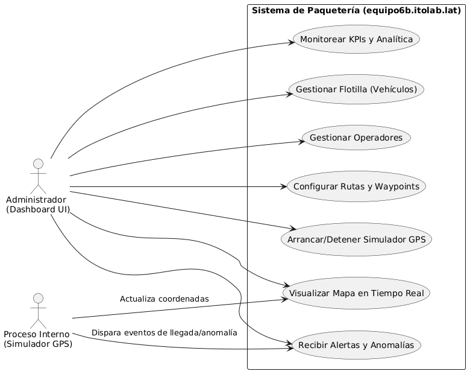
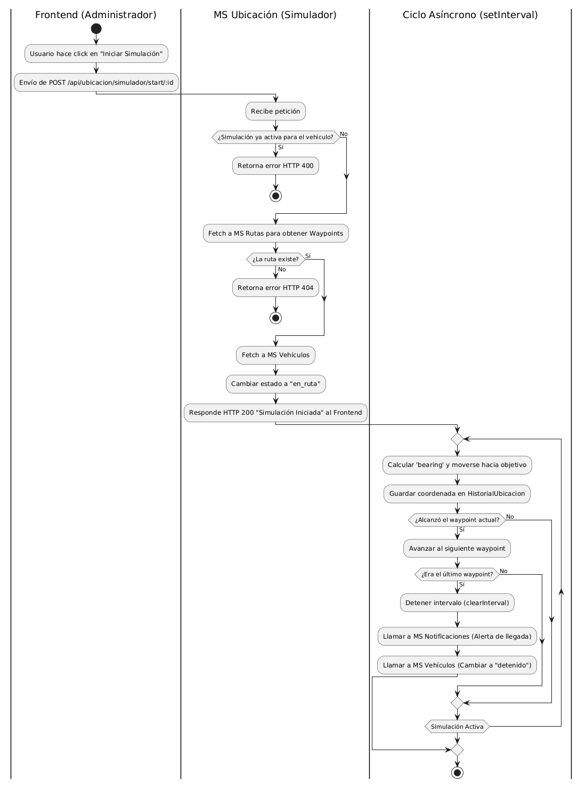
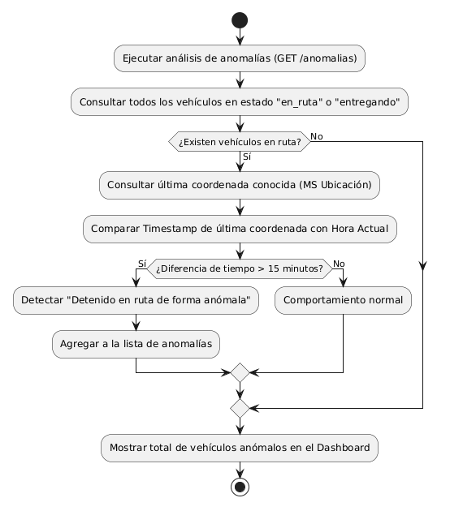

# Casos de Uso y Flujo del Sistema

## Actores del Sistema

### Administrador
Usuario del sistema. Gestiona la flota desde la interfaz web:
registra vehiculos y operadores, define rutas, asigna rutas a
vehiculos y monitorea la operacion en tiempo real.

### Sistema de Simulacion GPS
Componente interno del sistema (simuladorController.js).
Genera coordenadas geograficas cada 3 segundos simulando el
comportamiento de un dispositivo GPS instalado en cada vehiculo.
No es un usuario — es un actor automatizado.

> Nota sobre Operador: el Operador es una entidad de datos
> (conductor registrado con nombre, licencia y telefono), no
> un usuario del sistema. No inicia sesion ni interactua con
> la interfaz web.

---

## Casos de Uso Principales

### CU-01: Registrar Vehiculo
**Actor:** Administrador
**Descripcion:** El administrador accede al modulo de Vehiculos
y registra una nueva unidad con placa, modelo, capacidad y estado.
**Flujo:** Abrir formulario → ingresar datos → guardar →
el vehiculo aparece en la lista.
**Postcondicion:** Vehiculo disponible en el sistema con estado
"disponible".

### CU-02: Registrar Operador
**Actor:** Administrador
**Descripcion:** El administrador registra al conductor de una
unidad con nombre, numero de licencia y telefono.
**Flujo:** Modulo Operadores → Agregar Operador → guardar.

### CU-03: Definir Ruta
**Actor:** Administrador
**Descripcion:** El administrador crea una ruta con origen,
destino, waypoints, distancia estimada y duracion estimada.
**Flujo:** Modulo Rutas → Agregar Ruta → definir coordenadas
de origen/destino y waypoints → guardar.

### CU-04: Asignar Ruta a Vehiculo
**Actor:** Administrador
**Descripcion:** El administrador vincula una ruta a un vehiculo
para que el simulador GPS sepa que recorrido debe seguir.
**Flujo:** Seleccionar ruta → Asignar → seleccionar vehiculo →
confirmar.
**Postcondicion:** El vehiculo tiene rutaAsignadaId actualizado.

### CU-05: Iniciar Simulacion GPS
**Actor:** Administrador
**Descripcion:** El administrador inicia el simulador para un
vehiculo. El sistema consulta la ruta asignada, obtiene los
waypoints reales por calles via OSRM y comienza a generar
coordenadas cada 3 segundos.
**Flujo:** POST /api/ubicacion/simulador/start/:vehiculoId →
el simulador registra posiciones en HistorialUbicacion.

### CU-06: Monitorear Vehiculos en Tiempo Real
**Actor:** Administrador
**Descripcion:** El administrador visualiza en el mapa la
posicion actual de todos los vehiculos en ruta. El frontend
consulta /api/seguimiento/activos cada 3 segundos y actualiza
los marcadores.
**Postcondicion:** Mapa actualizado con posicion y estado de
cada unidad.

### CU-07: Consultar Recorrido de un Vehiculo
**Actor:** Administrador
**Descripcion:** El administrador hace click en un vehiculo del
mapa o del panel lateral para ver la trayectoria recorrida.
El sistema consume /api/seguimiento/:id/historial y dibuja la
polyline sobre el mapa.

### CU-08: Consultar Analisis y Recomendaciones
**Actor:** Administrador
**Descripcion:** El administrador accede al modulo de Analisis
(DSS) para revisar KPIs, graficas de rendimiento y
recomendaciones automaticas del sistema sobre eficiencia de
flota, rutas criticas y anomalias.

---

## Flujo Completo del Sistema

1. El administrador registra los vehiculos de la flota
2. El administrador registra los operadores (conductores)
3. El administrador define las rutas con waypoints
4. El administrador asigna una ruta a cada vehiculo
5. El Sistema GPS inicia la simulacion de coordenadas
6. Las coordenadas se actualizan cada 3 segundos via OSRM
7. El frontend consulta la ubicacion y actualiza el mapa
8. El administrador monitorea y consulta el historial
9. El modulo de Analisis genera recomendaciones en tiempo real

---

## Diagramas

### Diagrama de Casos de Uso

### Diagrama de Actividades

### Diagrama de Actividades Simplificado

