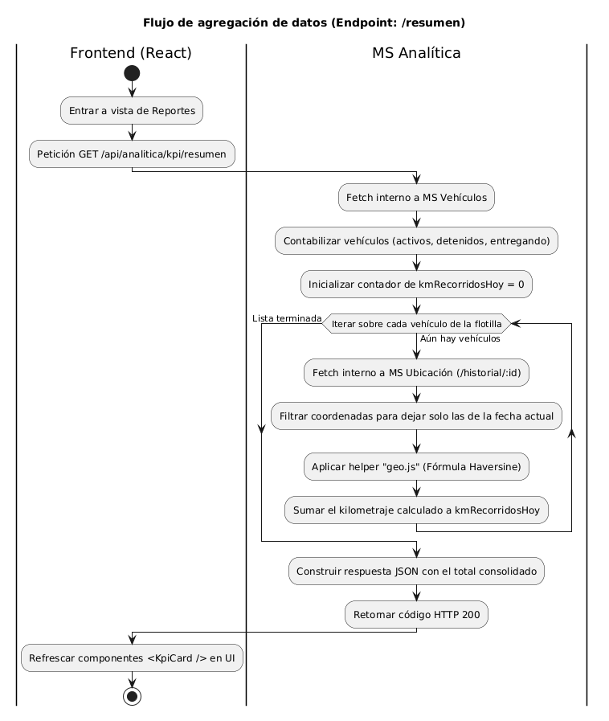

# Casos de Uso y Flujo del Sistema

Este documento describe formalmente la interaccion entre los
actores y el sistema de **Proyecto Paqueteria**, apoyado por
diagramas disenados en Draw.io.

---

## Actores del Sistema

### Administrador
Usuario de la interfaz web encargado de registrar la
infraestructura (vehiculos, operadores, rutas) y monitorear
la operacion en tiempo real desde el panel de control.

### Sistema de Simulacion GPS
Microservicio interno (ubicacion:3003) que simula el hardware
GPS instalado en los vehiculos, generando e inyectando
coordenadas geograficas reales cada 3 segundos al historial.
Consulta la API de OSRM para seguir calles reales.

> **Nota sobre Operador:** El Operador es una entidad de datos
> (conductor registrado con nombre, licencia y telefono), no
> un usuario del sistema. No inicia sesion ni interactua con
> la interfaz web directamente.

---

## Casos de Uso Principales

### CU-01: Gestion de Flotilla
- **Actor:** Administrador
- **Descripcion:** Registra vehiculos y operadores en el sistema.
- **Flujo:**
  1. Navega al modulo de Vehiculos u Operadores
  2. Llena el formulario con los datos requeridos
  3. El sistema persiste la entidad en MongoDB (db_vehiculos)

### CU-02: Diseno y Asignacion de Rutas
- **Actor:** Administrador
- **Descripcion:** Define trayectos con waypoints y asigna un
  vehiculo disponible para recorrerlos.
- **Flujo:**
  1. Ingresa origen, destino y waypoints con coordenadas
  2. El sistema calcula distancia y guarda en db_rutas
  3. Asigna un vehiculo especifico a la ruta

### CU-03: Iniciar Simulacion GPS
- **Actor:** Administrador
- **Descripcion:** Activa el simulador para un vehiculo. El
  sistema consulta los waypoints de la ruta asignada, obtiene
  la geometria real de calles via OSRM y comienza a generar
  coordenadas cada 3 segundos.
- **Flujo:**
  1. POST /api/ubicacion/simulador/start/:vehiculoId
  2. El Sistema GPS obtiene ruta real por calles (OSRM)
  3. Persiste posiciones en HistorialUbicacion cada 3s

### CU-04: Seguimiento y Monitoreo en Tiempo Real
- **Actores:** Administrador, Sistema de Simulacion GPS
- **Descripcion:** El administrador observa los vehiculos
  moverse en el mapa mientras el simulador genera posiciones.
- **Flujo:**
  1. El Sistema GPS emite coordenadas cada 3 segundos
  2. El frontend consulta /api/seguimiento/activos cada 3s
  3. Los marcadores se actualizan en el mapa con bearing correcto
  4. Click en un vehiculo muestra su recorrido historico

### CU-05: Consultar Analisis y Recomendaciones (DSS)
- **Actor:** Administrador
- **Descripcion:** Accede al modulo de Analisis para revisar
  KPIs de rendimiento y recomendaciones automaticas del sistema.
- **Flujo:**
  1. El servicio Analitica extrae datos via HTTP (ETL)
  2. Calcula KPIs: km recorridos, entregas, anomalias
  3. El dashboard muestra graficas e insights accionables
  4. El administrador puede exportar el reporte (CSV/PDF)

---

## Flujo Completo del Sistema

1. El administrador registra vehiculos y operadores
2. Define rutas con origen, destino y waypoints
3. Asigna una ruta a cada vehiculo
4. Inicia la simulacion GPS para los vehiculos activos
5. El Sistema GPS genera coordenadas reales por calles (OSRM)
6. Las posiciones se actualizan cada 3 segundos
7. El administrador monitorea la flota en el mapa en tiempo real
8. Consulta el recorrido historico de cada unidad
9. El modulo de Analisis genera recomendaciones automaticas

---

## Diagramas de Actividad

Los diagramas detallan el flujo paso a paso de los procesos
internos del sistema.

### Flujo Completo de Operacion

### Flujo Simplificado
Representacion resumida del ciclo de vida de un envio.

### Flujo de KPIs Analiticos
Muestra como la informacion del Simulador GPS fluye hacia
Analitica para ser procesada y mostrada en el Dashboard DSS.

